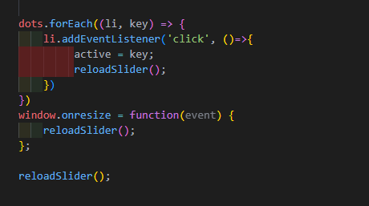
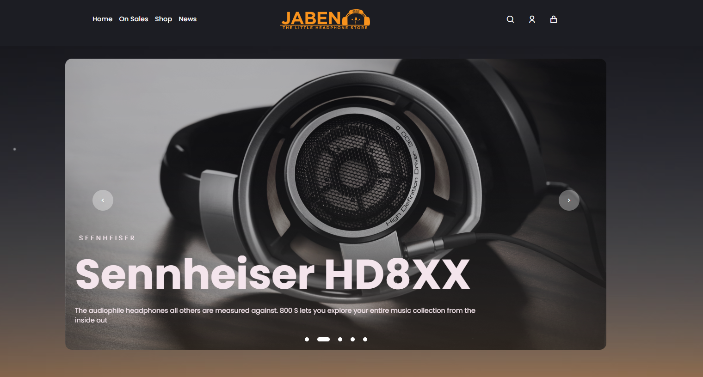
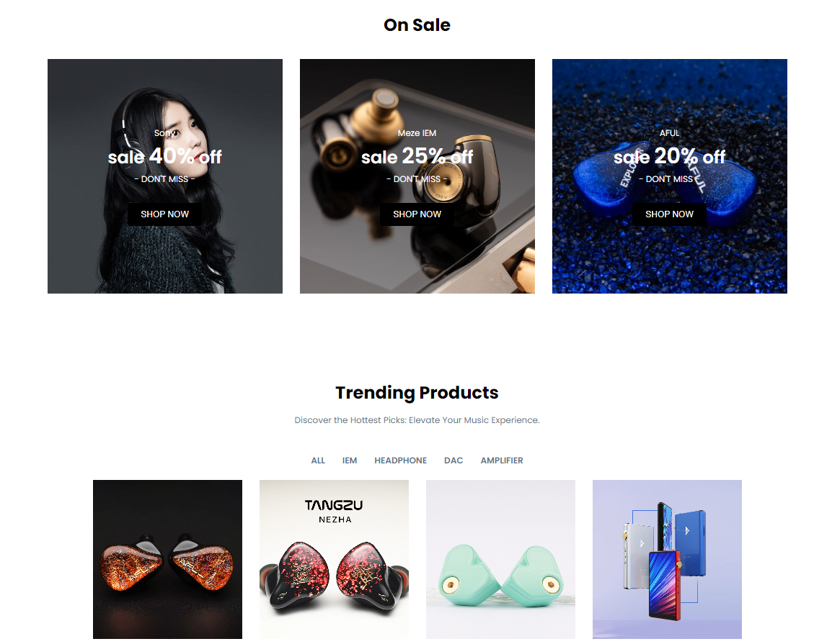
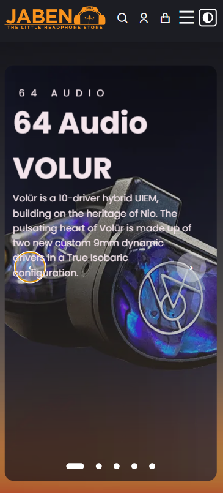

<h1 align="left">Glad to see you here !  </h1>
hi, I'm Samuel. I am here to explain my project e-commerce for audio shop, that i've been build recently. it was build based on real audio shop in singapore named jaben.


## Screenshots


### Built on 

- 💻 [Html](https://www.typescriptlang.org/)

- 🚀 [CSS](https://nextjs.org/)

- ⚛️ [Javascript](https://reactjs.org/)

- 🚀 [External/Internal Source](#Domain)
  - Icon
  - Image


## Table of Contents

- [Installation and Deploy](#Installation)
- [Development](#Development)
- [Depedency](#Domain)


<a id="Installation"></a>

## Installation ⚡

Install my-project with this following step

```bash
  Go to https://github.com/samuelindraw/milestone1---JABEN
  Git Clone https://github.com/samuelindraw/milestone1---JABEN
  Open index.html or launch it with live server on visual studio code 
```

If you want to modify it you can use fork my repository insted : 


We are very happy if you are interested and also contributing to My portofolio project 🤗

Here are a few options:

- Star this repo.

- Create issues every time you feel something is missing or goes wrong.


### Header info
| Header | Description |
| --- | --- |
| `Home` | Home is an introduction page |
| `On Sale` | Telling if any item on sale |
| `Shop` | Where shop catalog begin |
| `News` | News |
| `Footer` | More description here. |


# Development
Explain development stage from Scratch.
The difficulty of create a website is the design, because without the design we never know how to create it, after finding the right design, then i focused to create the HTML structure and CSS. All i can think is using grid view as it will help me to determine the right spot to place my image or layouting the E-commerce shop list, After that i use some transition and animation using Javascript and CSS animation to make the page more lively. Here is the list of what i was doing :

1. Create HTML Structure and HTML Sematic 
2. Create HTML Image and Media Elements
3. Create CSS Styling to make it the page more convinient to see
4. Create Typograhpy and Icon using remix icon
5. Create Optimized Responsive Design 
6. Add javascript Animation 

## Create HTML Structure and HTML Sematic 


## Create HTML Image and Media Elements


## Create CSS Styling to make it the page more convinient to see


## Create Typograhpy and Icon using remix icon


## Create Optimized Responsive Design 


## Add javascript Animation  




# Screenshot





## Responsive




# Depedency 
An external library is a collection of code (functions, classes, and other components) that extends the functionality of a programming language beyond what’s available in its core libraries. On my project i use : 

1. Remix Icon
>Remix Icon is a set of open-source neutral-style system symbols for designers and developers. Unlike a patchwork icon library, 2800+ icons are all elaborately crafted so that they are born with the genes of readability, consistency, and perfect pixels. Each icon was designed in "Outlined" and "Filled" styles based on a 24x24 grid. Of course, all the icons are free for both personal and commercial use.

I use remix icon to provide an icon in my website


2. Font 
I use font from google api to make text preetier and match to the design pattern


<br>

<br>


3. Javascript 
I use javascript to make carousel, dark mode using local storage and smooth slider 


<br>

<br>


# Specific Design 

Specific Design that i was use, is changing hamburger button to magnifier and shopping card and also i use carousel using js since when i use css its not responsive


<a id="deployment"></a>

# Deployment

if you want your website to be accessible to other people you need to deploy it. 
in this case i was using vercel to deploy my website.


what is vercel ? 


Vercel is a powerful cloud platform that simplifies web development and deployment for frontend developers. 

## Deployment Step

### Register on Vercel
>You can register using Github account 

Step 1: After register you will see dashboard of vercel site\
Step 2: You can see, Your repository that connected to your github account and recent project\
Step 3: You can also add new project by clicking Add New\

<br> 


<br>

### Connect and Deploy Your Repository
>Connect to your own github repository


<br>

#### Step 1: Fork project `https://github.com/revou-fsse-5/module-2-samuelindraw`

> Vercel cannot takes from private repository, while revou repository is private so we mush clone to our public repository.


<br>

#### Step 2: Locate to Project folder
> After forking from RevoU repository we need to create Project and Import our git repository to Configure Project 

<br>


<br> 
<br> 


#### Step 3: Configure Project 
> We need to configure our project, By Choosing repository name and set framework that we use, if we only use html or css we can use other option.

* insert Project Name 
* Choose Framwork
* Deploy 

<br>


<br>
<br>

> here is what you see, when deployment was success

<br>


<br>
<br>

#### Step 4: Configure Deploy Site
> You can change domain or anything else after we finish deployment


<br> 

* Check your project and click the settings 
* You will see more action on left side, choose domain
* And there you can change vercel domain
<br>

<a id="Domain"></a>

# Domain Configuration

Why we need domain ? 
>A domain is like your website’s street address. It’s the unique reference that identifies your website online. When customers type it into their browsers, they find your site. 

## Step 1 : Register and Login at Niaga Hoster
> you can register and login using your own gmail / github email

<br>


<br>
<br>

## Step 2 : Go to domain tab and search whenever domain that you will use.\
`how to choose domain name`
* Prioritize Brandability: A unique, brandable domain stands out. 
* Keep It Short: Shorter domain names are easier to remember.

<br>


<br>
<br>

## Step 3 : Buy domain that suites you 

1. You can pay using virtual account, bank transfer or etc
2. After that you can verify your email.
3. Check Dashboard and see if your domain name is activated

<br>


<br>

<br>


## Step 4: Setup Custom Domain

1. On vercel, Click your recent project and click Domain

<br>


<br>

2. Your can add your custom domain, Domain provider that you have buy.

<br>


<br>

<br>


<br>

3. After adding custom domain, you will see that there 
was a list your custom domain, with some notice 
> [!CAUTION]
> Invalid configuration.

<br>


<br>

4. Connect Vercel DNS to Domain Hosting \
1 On name server choose use vercel DNS \
2 Then Look at set the names apex domain to\
3 Copy that and configure it on your custom domain site

<br>


<br>

<br>


<br>

# DONE !!!

> [!TIP]
> AND YOU ARE SET, JUST WAIT AND YOU CAN USE YOUR CUSTOM DOMAIN !!! 

## deployment link

# DEPLOYMENT LINK
> [!IMPORTANT]
> This is my deployment link.
https://myportofolio.online/
https://portofoliositeme.vercel.app/


